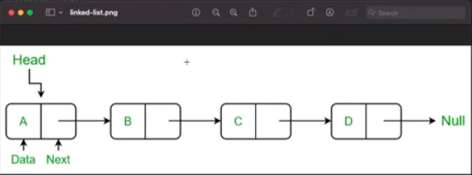

# LinkedList
What is a LinkedList?
 - A linked list is a data structure used to store a sequence of elements.
    - Unlike arrays, linkedList don't use contiguous memory locations.Instead each element (node) stores its value and a reference (or pointer) to the next node in the sequence
 
 Key Characteristics
 - Dynamic size: Can grow or shrink dynamically wihtout memory reallocation
 - Efficient Insertions/Deletions: Unlike arrays, inserting or deleting elements does not require shifting elements
	- I want to insert something say at the beginning of an array `[1, 2, 3] ` and i wnat to insert 0 at the beginning
		- well, that's an expensive operation because i have to add 0 here `[0, 1, 2, 3] ` and my data structure has to shift every element `1, 2,3` over to the right by one. So a very large data structures insertion is a very expensive operation
	- with linked list it's a very cheap operation because of the way the data structure works
 - Slower access time: To access an element, traversal from the head node is required
	- as we saw we don't get to access any element at anytime , we have to traverse the linkedlist from the head node to get to a particular node
 
 Real world examples of Linked Lists
 - Music playlist: Each song is a node, and each node points to the next song in the playlist
	- eg on Spotify unless you can view the list of the songs, you have to go through each individual song to get to the next one..you have to hit next repeatedly until you get to the song that you want 
 - Browser history: each web page visited is a done, with a reference to the previous and next page
	- if you only had those forward and backward arrows, and you din't have access to a list of your history that would be similar to a linkedlist
		- because you can only go forward and backward one thing at a time
 - Undo/Redo in text editors: Each edit is stored as a node, forming a linked structure for undo/redo operations
	- eg when i type `//bla bla bla //bla bla bla bla // bla bla bla bla` and i want to undo those things, it's sort of stored in a linkedlist where i have to undo them one at a time

A visual representation



- So the first node in the list is what is known as head. And as we can see here each node value has some sort of data and a pointer to the next node
	- so if i want to get to node C, I will have to start at A, then go to B, then go to C.
- The difference with an array is, I can just simple access C directly...that's the biggest difference between a linkedlist and an array

- To transverse through this LinkedList, I will have to go from  A to B, B to C, C to D, D to Null

Implementation 

- Let's build this class based on the information we have at hand
	- so go back to the definition, each node has some value and a pointer to the next node
	- and every node in a linked list is of that same type
	- so A will have a value and a pointer to the next node which is also a list node
- so let's work with an integer based linked list
	- so we have a class `class ListNode {}`
		- the reason why this needs to be a class, so if we make it a struct which don't have reference semantics we cannot have a stored property that recursively contains that thing, that's why it needs to be a class so we can use those reference-based semantics such that each list node can have a reference to another list node which is of same that type 
		- so we have a value `var val: Int`
		- we'll have a next value, an optional list node `var next: ListNode?`
		- we are going to write a couple of different initializers
			- eg we are going to have a blank initializer `init() { self.val = 0 self.next = nil }`
			- and then we have this value initializer  `init(_ val: Int) { self.val = val self.nex = nil}`
			- and then we have an initializer where we can pass in a value and a next `init(_ val: Int, next: ListNode?) { self.val = val self.next = next }` 
```
class ListNode {
	var val: Int
	var next: ListNode?
	
	init() {
		self.val = 0
		self.next = nil
	}

	init(_ val: Int) {
		self.val = val
		self.next = nil 
	}

	init(_ val: Int, _ next: ListNode?) {
		self.val = val
		self.next = next
	}
}
```

- continue*1
	- so we have 3 optional inits
		- if we do a blank init, it will give us a zero based node where there is no next value
		- we can also initialize it with a value 
		- or we could pass in both input parameters to initialize this class with a value and a next node

- Now, let's see if we can take this array `[0, 1, 2, 3] ` and build a linked list out of it
	- so essentially it would look something like this `// 0 -> 1 -> 2 -> 3` 0 points to 1 which points to 2 which points to 3
	- so `let node0 = ListNode()`
	- and a list node with a value of 1 `let node1 = ListNode(1)`
	- and node2 `let node2 = ListNode(2)`
	- and node3 `let node1 = ListNode(3)`
	- so we have 4 nodes and we need to connect them
		- so i'm gonna say node0.next equals to node1 `node0.next = node1`
		- and `node1.next = node2`
		- and `node2.next = node3`
		- and node3 next value will be nill, so 0 points 1, 1 points to 2, 2 points to 3
- Let's write a function that can traverse through a list...this will be an equivalent of looping through an array but let's see if we can strat from the head of our list and iterate through it all the way until we get to the end
	- so `func traverseLinkedList(_ head: ListNode?) {}` and it's going to print out the node values at each point
		- so let's create a pointer...sort of like an iterator..the same we use pointer techniques in array where we create a left and right pointer
			- we will do the same thing with a linkedlist
		- so we are going to start the pointer at the head and just iterate through as we go
			- so `var pointer = head` so our pointer equals to the head of our list
		- then say, while pointer is not equal to nil `while pointer != nil { print(pointer.val) pointer = pointer.next }`
			- so this `pointer = pointer.next ` is how we iterate through a list
		- so the reason why we make this ListNode optional is because the only way we know we're at the end of the list is if this pointer is eventually nil
			- so `pointer != nil ` so we are gonna keep iterating by going next next
		- so from our diagram above, the pointer is now equal to the head


- So we start here "points to Head arrow" and pointer is equal to the head which is nodeA, and then its gonna say print out that value which will be A
	- and in our case it's 0 
	- and then it's gonna say pointer is equal to pointer.next, well next is equal to B, and now the pointer is at B, it does the same thing, then goes to C does same thing goes to D does the same thing but then pointer eventually becomes null and that's how we know that we need to stop our loop and the function will finish

```
func traverseLinkedList(_ head: ListNode?) {
	var pointer = head

	while pointer != nil {
		print(pointer?.val) 
		pointer = pointer?.next
	}
}
```

- Now, let's go ahead and say, `traverseLinkedList(` and we gonna pass in node0 as the head `traverseLinkedList(node0)` and run and see what we get
	- it prints correctly which traverse through our entire list and eventually pointer become equal to nil see the project code 
